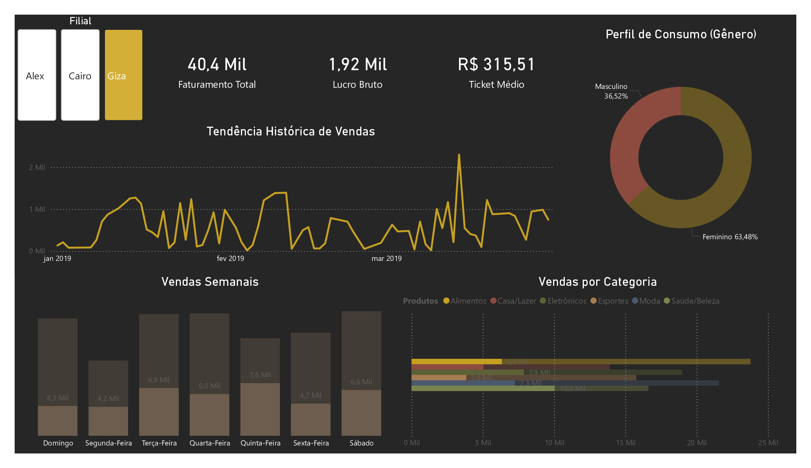

# Dashboard de Análise de Vendas - Supermercado

Este projeto foi desenvolvido como parte do meu portfólio de **Análise de Dados**. O objetivo foi transformar dados brutos de vendas em um painel visual que facilite a tomada de decisão.

## 🚀 O que foi feito:
* **Tratamento de Dados:** Limpeza e organização dos dados utilizando o **Power Query** (tradução de categorias, ajuste de datas e criação de colunas de dias da semana).
* **Visual Design:** Aplicação de um tema personalizado (**Autumn Muted**) em modo escuro para garantir uma leitura confortável e moderna.
* **KPIs Principais:** Visualização rápida de Faturamento Total, Lucro Bruto e Ticket Médio.
* **Filtros Interativos:** Segmentação por Filial e Categoria de Produto para análises específicas.

## 🛠️ Ferramentas Utilizadas:
* **Power BI**
* **Power Query** (ETL)
* **Excel/CSV** (Fonte dos dados)

---

### 📷 Visual do Dashboard:

